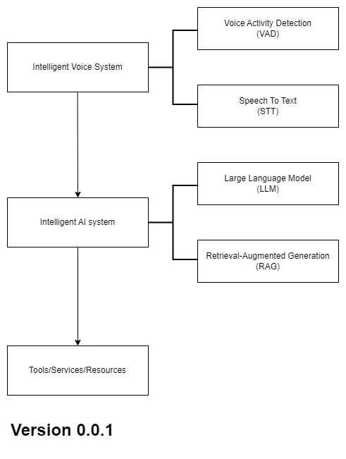

# 🤖 JAssistant - Your Personal Life AI Assistant (像 Jarvis 一样的生活助理)

## ✨ 前言

小的时候刚接触电脑编程，名字我记得叫易语言，那时我使用if else语句制作了一个智能助手，很简单希望它能理解我说什么并做出一定行为来帮助我。后来我看了钢铁侠，其中的贾维斯(Jarvis), 它真的完美符合我的幻想，一个很Cool的AI去帮助它的Master。

2022年低OpenAI ChatGPT大火，它就像彻底加速人类通往超级人工智能的步伐，使我看到了可以达到Jarvis程度的AI Asistant(Maybe)，所以我想要尝试实现它(接近)。

这个项目的开始，有几个目标：
1. 尝试让AI来改变生活
2. 更加全面的结合自己的技能来尝试完成项目
3. 尝试使用市面上的LLM，开源的工具等来封装一个AI Asisstant System。实现过程需要使用MCP等系列工具来完成LLM的行为分装。
4. 文档尝试使用中/英双语来解释项目(我正在学习英语)。

我的水平可能并不高，也不是AI专业的人员，所以我将尽最大努力去实现我心中所想。

---

## 🧩 系统设计

参考链接：
- 🔗 [Linux.do](https://linux.do/t/topic/604609/2)
- 🔗 [sherpa/onnx](https://k2-fsa.github.io/sherpa/onnx/kws/pretrained_models/index.html)
- 🔗 [whisper_streaming](https://github.com/ufal/whisper_streaming)
- 🔗 [silero-vad](https://github.com/snakers4/silero-vad)
- 🔗 [pyannote-audio](https://github.com/pyannote/pyannote-audio/tree/main)

系统总共包含三大模块：

- 🎙️ **IVS (Intelligent Voice System)**  
  负责监听与识别 Human 的声音，激活系统并将语音转换为文本指令。

- 🧠 **IAIS (Intelligent AI System)**  
  整个系统的大脑，理解 Human 的意图并调用具体的服务与工具完成任务。

- 🛠️ **TSR (Tools / Services / Resources)**  
  由多个 MCP 风格的服务组成，比如天气查询、远程控制等。

📌 思维导图：

---

## 🗓️ 开发计划

1. 🎧 实现 VAD 模块（例如基于 silero-vad）监听关键字唤醒系统  
2. 🗣️ 使用 Whisper 实现语音转文本  
3. 🧾 搭建 MCP 服务系统，实现如天气查询、远程关机等简易功能  
4. 🧼 完善项目结构，进行模块化封装  
5. 🏃 性能优化，尽可能运行在低配机器上运行项目
6. 🧪 持续迭代（TBD）

开发日志将保存在 `docs/` 文件夹下 📁

---

## 💻 开发环境

- 🖥️ Windows 10 / Ubuntu 20.04  
- 🐍 Python 3.10+  
- ⚙️ 支持 GPU 的硬件环境  
